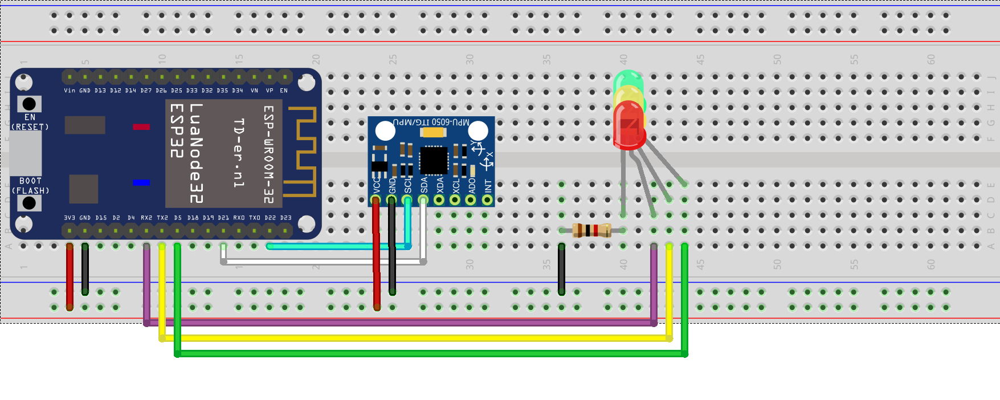

# Monitoramento da vibração de equipamentos para manutenção preditiva usando IoT

## Arquitetura do hardware

- Microcontrolador ESP32
- Sensor MPU-6050 (acelerômetro/giroscópio)
- LEDs



Conforme o desenho, o microcontrolador se conecta ao sensor pela interface I2C, pinos SLC e SDA. Os LED`s utilizam as portas GPIO 5, 16 e 17.

## Arquivos (hardware)

- **sensor.ino** - arquivo principal que realiza os seguintes procedimentos:
    - **Conexão com wifi local** (_init_wifi / connect_wifi / verify_wifi_connection_);
    - **Conexão npt server** para sincronizar relógio;
    - **Conexão com broker MQTT** para publicação e recebimento de mensagens (_init_MQTT - define configurações para conexão com broker MQTT; connect_MQTT - conecta com broker MQTT e subscreve ao topic "equipment/actions" em mqtt_callback_);
    - **Acionamento de LED's** ( mqtt_callback - recebe JSON com as informações necessárias);
    - **Leitura e envio de dados de vibração** (função _loop_ realiza a leitura, acumula e empacota JSON para publicar em "equipment/vibration");
    - Configurações gerais e função de controle _setup_.

- **I2C.ino** - arquivo complementar, realiza a leitura e gravação de registradores, extraindo as informações dos eixos pitch e roll.

## Arquivos (Server)

### Broker

- **initialize_DB_Tables.py** cria banco de dados para armazenar leituras;
- **mqtt_Listen_Sensor_Data.py** conecta e subscreve ao broker para receber os pacotes enviados pelo sensor;
- **store_Sensor_Data_to_DB.py** conecta ao ao banco de dados, desempacota JSON e grava as leituras;
- **IoT.db** banco de dados.

### Algoritmo de análise de vibração


- **main.py** arquivo principal que organiza a leitura e processamento dos dados gravados e plota o gráfico em tela;
- **read_data.py** busca as informações de vibração armazenadas em banco de dados
- **calc.py** com funções que realizam o cálculo do desvio padrão, cálculo e armazenaento do offset e definição dos limites das faixas de repouso/operação/alerta
- **mqtt_send.py** subscreve e publica mensagens para comunicação com ESP32 e com dashboard mobile - acionamento de leds, contagem de alertas e formatação e envio de dados de vibração
- **settings.py** armazenamento e leitura de offsets no arquivo settings.ini
- **settings.ini** armazena os offsets de pitch e roll
- **simulate.py** complementar, simula o processo de gravação das leituras em banco de dados em blocos de 10, da mesma forma que é feito pelo broker MQTT quando o ESP está ativo. Deve ser acionado por uma thread no arquivo *main.py*.


## Instruções


### Pré-requisitos

- Instalar Mosquitto (MacOS):
```
brew install mosquitto
```

- Instalar paho-mqtt localmente
```
pip3 install paho–mqtt
```

- Instalar Python3 com bibliotecas numpy, sqlite3, pandas, matplotlib, paho, json, threading

- Instalar IDE Arduino ou similar para compilar para o ESP32


### Configurações

- Alterar referências ao endereço IP do broker MQTT
- Alterar referências a rede Wifi (ssid, user, password)


### Executar

- Executar Mosquitto (MacOS)
```
/usr/local/sbin/mosquitto -c /usr/local/etc/mosquitto/mosquitto.conf
```

- Executar script para realizar recebimento de dados MQTT e 
```
python3 mqtt_Listen_Sensor_Data.py 
```

- Iniciar server:
```
python3 main.py
```


### Complementar

- Acessar dados via SQLite:
```
sqlite3 IoT.db
```

- Simular Mosquitto pub e sub:
```
mosquitto_pub -t xpto/temperature -m 22
mosquitto_sub -h 192.168.0.25 -p 1883 -v -t 'xpto/temperature'
```


## Referências:

[Kalman Filter](https://github.com/TKJElectronics/KalmanFilter) - TKJElectronics

[Enviar e receber dados via MQTT](http://newtoncbraga.com.br/index.php/microcontrolador/143-tecnologia/17070-enviando-e-recebendo-dados-via-mqtt-com-o-esp32-mic373) - Newton C Braga

[MQTT read and store data](https://iotbytes.wordpress.com/store-mqtt-data-from-sensors-into-sql-database) - IOTBytes, Pradeep Singh