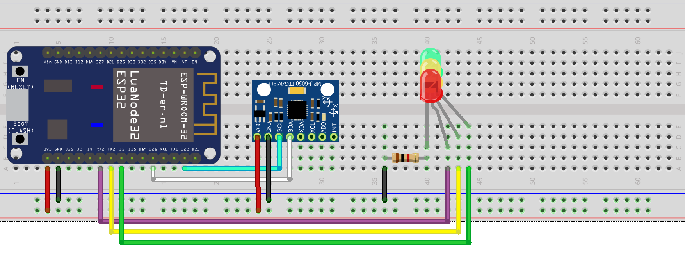

# Equipment vibration monitoring for predictive maintenance using IoT

## Hardware architecture

- ESP32 microcontroller
- MPU-6050 sensor (accelerometer/gyroscope)
- LEDs



As shown in the diagram, the microcontroller connects to the sensor over the I2C interface (SCL and SDA pins). The LEDs use GPIO pins 5, 16 and 17.

## Files (hardware)

- **sensor.ino**: main file, responsible for:
    - **Connecting to the local Wi-Fi** (_init_wifi / connect_wifi / verify_wifi_connection_);
    - **Connecting to an NTP server** to synchronize the clock;
    - **Connecting to the MQTT broker** to publish and receive messages (_init_MQTT_ sets up the broker connection; _connect_MQTT_ connects to the broker and subscribes to the "equipment/actions" topic in _mqtt_callback_);
    - **Driving the LEDs** (_mqtt_callback_ receives a JSON payload with the required information);
    - **Reading and sending vibration data** (the _loop_ function reads, accumulates and packs the readings into JSON to publish on "equipment/vibration");
    - General configuration and the _setup_ control function.

- **I2C.ino**: helper file that reads and writes registers, extracting the pitch and roll axis values.

## Files (server)

### Broker

- **initialize_DB_Tables.py** creates the database that stores the readings;
- **mqtt_Listen_Sensor_Data.py** connects and subscribes to the broker to receive the packets sent by the sensor;
- **store_Sensor_Data_to_DB.py** connects to the database, unpacks the JSON and stores the readings;
- **IoT.db** the database.

### Vibration analysis algorithm

- **main.py** main file that orchestrates reading and processing the stored data and plots the chart on screen;
- **read_data.py** fetches the vibration data stored in the database;
- **calc.py** functions that calculate the standard deviation, calculate and store the offset, and define the thresholds for the idle/operating/alert ranges;
- **mqtt_send.py** subscribes and publishes messages to communicate with the ESP32 and the mobile dashboard: driving the LEDs, counting alerts, and formatting and sending vibration data;
- **settings.py** stores and reads offsets in the settings.ini file;
- **settings.ini** stores the pitch and roll offsets;
- **simulate.py** helper that simulates writing readings to the database in blocks of 10, the same way the MQTT broker does when the ESP32 is active. It must be started by a thread in *main.py*.

## Instructions

### Prerequisites

- Install Mosquitto (macOS):
```
brew install mosquitto
```

- Install paho-mqtt locally:
```
pip3 install paho-mqtt
```

- Install Python 3 with the numpy, sqlite3, pandas, matplotlib, paho, json and threading libraries

- Install the Arduino IDE (or similar) to compile for the ESP32

### Configuration

- Update the references to the MQTT broker IP address
- Update the references to the Wi-Fi network (SSID, user, password)

### Running

- Start Mosquitto (macOS):
```
/usr/local/sbin/mosquitto -c /usr/local/etc/mosquitto/mosquitto.conf
```

- Run the script that receives the MQTT data:
```
python3 mqtt_Listen_Sensor_Data.py
```

- Start the server:
```
python3 main.py
```

### Extras

- Access the data through SQLite:
```
sqlite3 IoT.db
```

- Simulate Mosquitto publish and subscribe:
```
mosquitto_pub -t xpto/temperature -m 22
mosquitto_sub -h 192.168.0.25 -p 1883 -v -t 'xpto/temperature'
```

## References

[Kalman Filter](https://github.com/TKJElectronics/KalmanFilter) - TKJElectronics

[Sending and receiving data via MQTT](http://newtoncbraga.com.br/index.php/microcontrolador/143-tecnologia/17070-enviando-e-recebendo-dados-via-mqtt-com-o-esp32-mic373) (in Portuguese) - Newton C Braga

[MQTT read and store data](https://iotbytes.wordpress.com/store-mqtt-data-from-sensors-into-sql-database) - IOTBytes, Pradeep Singh
